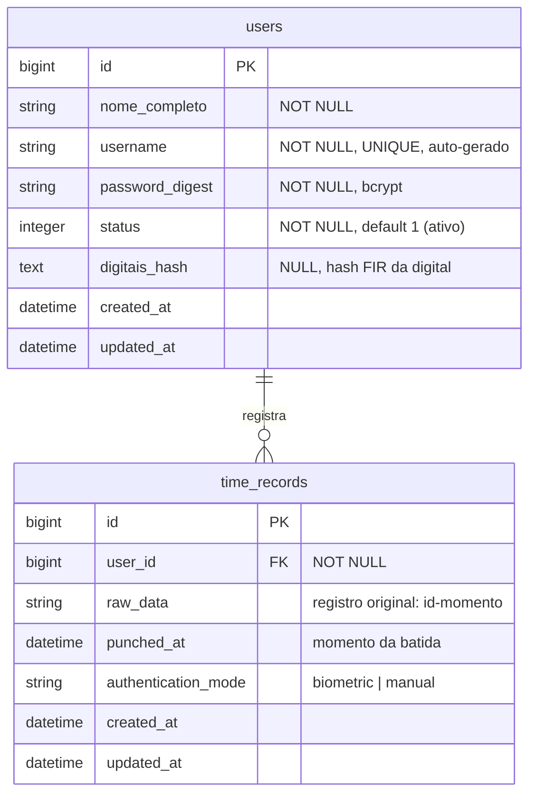
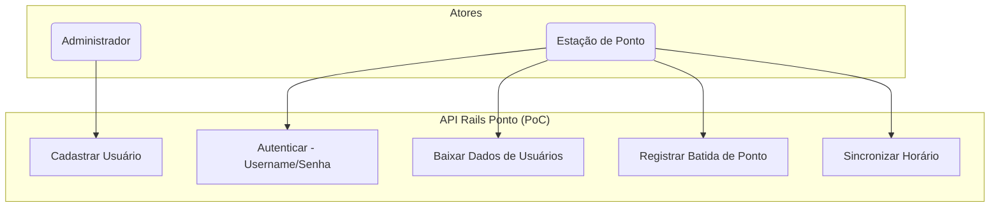
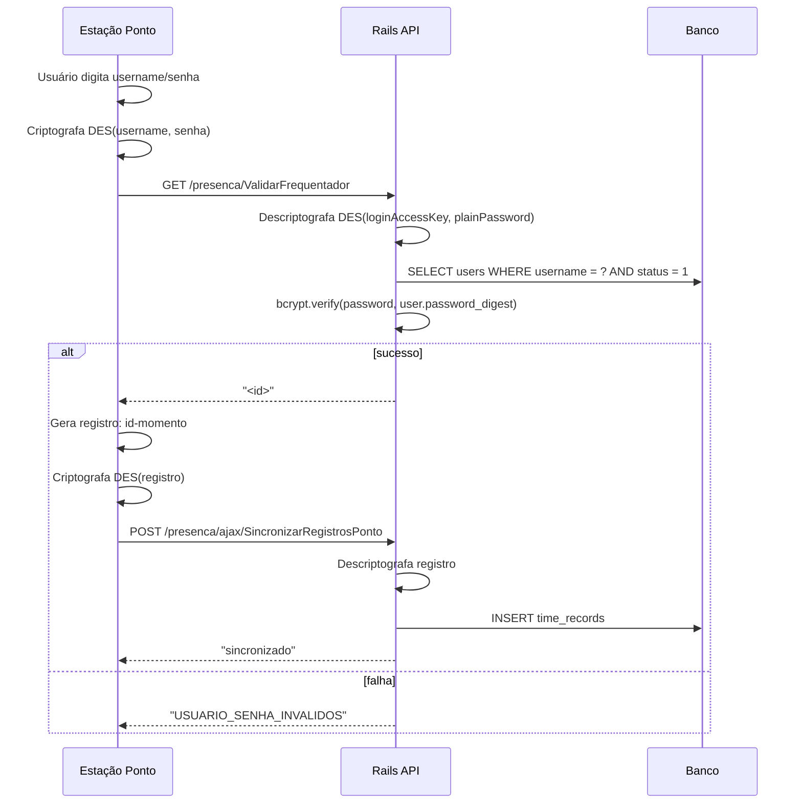
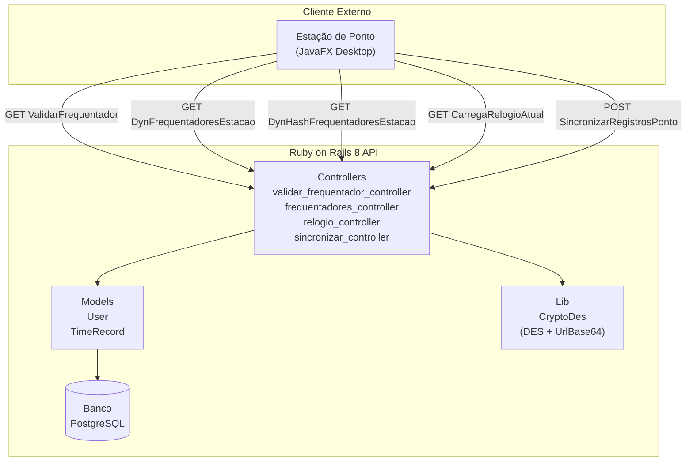

# PRD — Protótipo (PoC) API de Ponto em Ruby on Rails 8

> **Versão:** 1.0  
> **Data:** Julho/2026  
> **Status:** Rascunho para validação

---

## 1. Objetivo do Projeto

**Validar a comunicação bidirecional entre uma Estação de Ponto (cliente JavaFX Desktop) e uma API REST em Ruby on Rails 8 (servidor).**

A aplicação Rails substituirá, para fins de protótipo, o Módulo Presença da Intranet TJPI, provendo os endpoints necessários para que a Estação de Ponto existente consiga autenticar usuários (por biometria ou login/senha) e registrar batidas de ponto.

O sucesso do projeto é definido por: a Estação consegue se conectar à API Rails, autenticar um usuário, e registrar uma batida de ponto com retorno de confirmação.

---

## 2. Escopo e Fora do Escopo

### 2.1 Escopo (será implementado)

| Módulo | Funcionalidade |
|--------|---------------|
| **Cadastro de Usuários** | CRUD de usuários com nome completo, username (auto-gerado), senha e status (Ativo/Inativo) |
| **Autenticação Manual** | Validação de credenciais (username + senha criptografados via DES) |
| **Disponibilização de Dados Biométricos** | Endpoint que retorna usuários com hashes de digitais para reconhecimento local na estação |
| **Registro de Batidas** | Recebimento e armazenamento de registros de ponto enviados pela estação |
| **Sincronização de Horário** | Endpoint que retorna o timestamp atual do servidor |

### 2.2 Fora do Escopo (não será implementado nesta PoC)

- Relatórios, banco de horas, controle de jornada, dashboards
- Integrações com RH, folha de pagamento ou sistemas externos
- Heartbeat (VivoOuMorto / AdicioneEstacao)
- Prédios permitidos (PrediosPermitidos)
- Cache/download de fotos
- Cadastro de digitais via enrollment (a estação gerencia localmente)
- Upload de logs
- Auto-update (AtualizarEstacoes)
- Código de ativação de estação (será usado valor fixo na PoC)
- Bloqueio/desbloqueio de tela
- Interface web (UI) — a comunicação será exclusivamente via API REST

---

## 3. Requisitos Funcionais

### RF01 — Cadastro de Usuários

| ID | Requisito | Prioridade |
|----|-----------|-----------|
| RF01.1 | O sistema deve permitir criar, listar, editar e inativar usuários | Alta |
| RF01.2 | Cada usuário deve ter: nome completo, username, senha, status (Ativo/Inativo) | Alta |
| RF01.3 | O username deve ser gerado automaticamente a partir do nome completo no formato `nome.sobrenome` (em minúsculas, sem acentos, sem espaços) | Alta |
| RF01.4 | O username deve ser único | Alta |
| RF01.5 | O usuário pode ter um hash de digital armazenado (digitais_hash) | Alta |
| RF01.6 | A senha deve ser armazenada com hash seguro (bcrypt via Rails `has_secure_password`) | Alta |
| RF01.7 | Apenas usuários com status **Ativo** podem ser autenticados | Alta |

### RF02 — Autenticação Manual (Username + Senha)

| ID | Requisito | Prioridade |
|----|-----------|-----------|
| RF02.1 | O sistema deve expor endpoint que recebe username e senha criptografados em DES (chave `"cryp:gpf"`) | Alta |
| RF02.2 | O sistema deve descriptografar as credenciais e validar contra o banco | Alta |
| RF02.3 | Em caso de sucesso, retornar o ID numérico do usuário | Alta |
| RF02.4 | Em caso de falha, retornar exatamente as mensagens de erro previstas na documentação | Alta |

### RF03 — Disponibilização de Dados para Reconhecimento Biométrico

| ID | Requisito | Prioridade |
|----|-----------|-----------|
| RF03.1 | O sistema deve expor endpoint que retorna todos os usuários ativos com suas digitais_hash | Alta |
| RF03.2 | O formato de retorno deve ser compatível com o parse esperado pela Estação | Alta |
| RF03.3 | O sistema deve expor endpoint que retorna o hash MD5 dos dados serializados para controle de versão | Alta |

### RF04 — Registro de Batidas (Sincronização)

| ID | Requisito | Prioridade |
|----|-----------|-----------|
| RF04.1 | O sistema deve receber registros de ponto enviados pela estação via POST | Alta |
| RF04.2 | Cada registro deve conter: ID do usuário, momento da batida | Alta |
| RF04.3 | O sistema deve armazenar o registro com timestamp de recebimento | Alta |

### RF05 — Sincronização de Horário

| ID | Requisito | Prioridade |
|----|-----------|-----------|
| RF05.1 | O sistema deve expor endpoint que retorna o timestamp atual do servidor em milissegundos | Alta |

---

## 4. Regras de Negócio

| ID | Regra | Origem na Doc |
|----|-------|---------------|
| RN01 | Username deve ser único e gerado automaticamente a partir do nome completo | Documentação do escopo |
| RN02 | Apenas usuários com status **Ativo** podem ser autenticados ou ter dados retornados | Adaptado de RN02/RN03 |
| RN03 | A senha para autenticação manual é criptografada com DES/CBC/PKCS5Padding, chave `"cryp:gpf"`, codificada em UrlBase64 | Seção 12 do Relatório de Integração |
| RN04 | O código de ativação da estação será fixo para a PoC (`"poc-ativacao-001"`) | Simplificação |
| RN05 | O hash de retorno dos dados de usuários é calculado com MD5 sobre a string serializada | Seção 4.4 do Relatório |
| RN06 | Registros de batida são armazenados em formato texto: `<id>-<dd:MM:yyyy:HH:mm:ss>` | Seção 5.2 do Relatório |
| RN07 | O timestamp do servidor é a referência de horário; a estação calcula o delta local | Seção 9 do Relatório |

---

## 5. Fluxos de Autenticação

### 5.1 Autenticação por Username + Senha (Login Manual)

```
Estação                                   Rails API
   │                                          │
   │── GET /presenca/ValidarFrequentador ────>│
   │    ?loginAccessKey=<DES(username)>        │
   │    &plainPassword=<DES(password)>         │
   │    &codAtivacao=poc-ativacao-001         │
   │                                          │
   │    [Descriptografa credenciais]           │
   │    [Busca usuário por username]            │
   │    [Verifica senha (bcrypt)]               │
   │    [Verifica status = Ativo]               │
   │                                          │
   │<── "<id>" (sucesso) ──────────────────── │
   │    OU                                    │
   │<── "USUARIO_SENHA_INVALIDOS" ─────────── │
```

A estação já possui o hash da digital baixado via `DynFrequentadoresEstacao` e faz o match biométrico localmente (via SDK Nitgen). A API Rails **não** realiza o matching biométrico — ela apenas fornece os hashes para a estação.

### 5.2 Fluxo completo de uma batida biométrica

1. Estação baixa dados dos usuários via `DynFrequentadoresEstacao`
2. Estação carrega hashes no IndexSearch local (SDK Nitgen)
3. Usuário coloca o dedo no leitor
4. Estação captura a digital e busca no IndexSearch local
5. Se reconhecido: estação gera registro local `<id>-<momento>`
6. Estação envia lote de registros via `SincronizarRegistrosPonto` (POST)
7. Rails API armazena os registros

### 5.3 Fluxo Completo: Usuário Marca Ponto (JavaFX → Rails)

**Arquitetura do fluxo de marcação:**

```
┌─────────────────────────┐     HTTP/WebView     ┌──────────────────────────┐
│                         │ ───────────────────> │                          │
│   Estação Ponto         │                      │   Ruby on Rails 8 API    │
│   (JavaFX Desktop)      │ <──────────────────  │   (Servidor)             │
│                         │   HTML/Texto         │                          │
│                         │                      │                          │
│  ┌─────────────────┐    │                      │  ┌─────────────────┐      │
│  │ WebView (JavaFX) │    │                      │  │ Controllers     │      │
│  │ - Carrega JSPs   │    │                      │  │ - Presenca::*   │      │
│  │ - Executa JS     │    │                      │  └─────────────────┘      │
│  │ - onAlert()      │    │                      │  ┌─────────────────┐      │
│  └────────┬────────┘    │                      │  │ Models          │      │
│           │             │                      │  │ - User          │      │
│  ┌────────┴────────┐    │                      │  │ - TimeRecord    │      │
│  │ Java Services   │    │                      │  └─────────────────┘      │
│  │ - ConexaoIntra  │    │                      │  ┌─────────────────┐      │
│  │ - ValidarBatida │    │                      │  │ Services        │      │
│  │ - DownloadFreq  │    │                      │  │ - CryptoDes     │      │
│  │ - VivoOuMorto   │    │                      │  │ - FreqSerializer│      │
│  └────────┬────────┘    │                      │  └─────────────────┘      │
│           │             │                      │                          │
│  ┌────────┴────────┐    │                      │                          │
│  │ SDK Nitgen      │    │                      │                          │
│  │ (biometria)     │    │                      │                          │
│  └─────────────────┘    │                      │                          │
└─────────────────────────┘                      └──────────────────────────┘
```

**Passo a passo — Marcação de ponto:**

**Fase 1: Inicialização da Estação**
1. `TelaPonto.initWebEngine()` inicia uma thread que chama `ConexaoIntranetService.isConectado()`
2. `isConectado()` faz `GET /presenca/CarregaRelogioAtual` → recebe timestamp em ms
3. Se conectado: WebView carrega `GET /presenca/IniciarPonto`
4. `ChangeUrlListener` detecta `presenca/IniciarPonto` → redireciona para `GET /presenca/InicializarPonto?codigoAtivacao=...&codigoUnicoMaquina=...`
5. `InicializarPonto` retorna HTML com JavaScript redirect → carrega `GET /presenca/PontoDePresenca`
6. `PontoDePresenca` executa `alert('downloadFrequentadores')` → `OnAlertListener` dispara download de digitais

**Fase 2: Download de Dados Biométricos**
7. `DownloadFrequentadoresService` chama `GET /presenca/DynHashFrequentadoresEstacao` → compara MD5 com hash local
8. Se diferente: chama `GET /presenca/DynFrequentadoresEstacao` → recebe dados serializados
9. Estação carrega hashes no IndexSearch local (SDK Nitgen)
10. `Operacao.RECUPERAR_FREQUENTADORES` completa → chama `alert('removeLoading')`

**Fase 3: Marcação de Ponto (Biométrico)**
11. Usuário coloca o dedo no leitor Nitgen
12. `PreProcessandoService` → `VerificacaoDigitalService` → busca no IndexSearch local
13. Se reconhecido (ID > 0):
    - `ArquivoRegistros.escreverRegistro("id-dd:MM:yyyy:HH:mm:ss")` — grava localmente
    - `The.inserirJavascript("process('DIGITAL_RECONHECIDA', dados)")` — atualiza interface
    - Toca som de sucesso
14. Se não reconhecido: toca som de erro

**Fase 4: Marcação de Ponto (Manual)**
15. Usuário clica "Login Manual" na interface Web
16. JavaScript: `alert('LOGINMANUAL')` → `Operacao.LOGINMANUAL.execute()`
17. `ValidarBatidaManualService`:
    - `CryptoUtils.encryptDES("cryp:gpf", username)` → `loginAccessKey`
    - `CryptoUtils.encryptDES("cryp:gpf", password)` → `plainPassword`
    - `GET /prescenza/ValidarFrequentador?loginAccessKey=...&plainPassword=...&codAtivacao=...`
18. API retorna `"<id>"` (sucesso) ou `"USUARIO_SENHA_INVALIDOS"` (falha)
19. Se sucesso: gera registro local `"id-dd:MM:yyyy:HH:mm:ss"`

**Fase 5: Sincronização de Registros**
20. A cada 5 minutos (`ThreadRelogio.fazerSincronizacao()`):
    - `ConexaoIntranetService` verifica conectividade
    - `MainController.iniciarSincronizacao()`:
      - `ArquivoRegistros.lerArquivoSincronizado()` — lê registros do arquivo
      - `The.inserirJavascript("sincronizaPonto('dados','codAtivacao')")` — chama JS
    - JavaScript `sincronizaPonto()`:
      - `fetch('POST /presenca/ajax/SincronizarRegistrosPonto', {body: 'registros=...&codAtivacao=...'})`
    - API Rails:
      - Descriptografa (DES) ou aceita plain text
      - Parseia cada linha: `<id>-<dd:MM:yyyy:HH:mm:ss>`
      - Cria `TimeRecord` com `user_id`, `raw_data`, `punched_at`, `authentication_mode`
      - Retorna `"sincronizado"`
    - `ArquivoRegistros.limparArquivo()` — limpa registros sincronizados

**Fase 6: Sincronização de Horário**
21. A cada 5 minutos: `GET /prescenza/CarregaRelogioAtual` → atualiza `ThreadRelogio`
22. `MainController.atualizarHorario(horario)` → `The.inserirJavascript("atualizaRelogioLocal('HH:MM')")`
23. Station também envia heartbeat: `GET /prescenza/AdicioneEstacao?codAtivacao=...&versao=...&estadoEstacao=FUNCIONANDO`

**Armazenamento local (modo offline):**
- Registros são armazenados criptografados em `regs.txt` (formato DES)
- Se a estação ficar offline, os registros permanecem no arquivo
- Quando a conexão for restabelecida, os registros são sincronizados automaticamente

---

## 6. Arquitetura da Solução

```
┌─────────────────────────┐     HTTP (GET/POST)     ┌──────────────────────────┐
│                         │ ──────────────────────> │                          │
│   Estação de Ponto      │                         │   Ruby on Rails 8 API    │
│   (Cliente JavaFX)      │ <────────────────────── │   (Servidor)             │
│                         │    JSON / Texto         │                          │
│  - Leitor Biométrico    │                         │  - Puma (Web Server)     │
│  - SDK Nitgen           │                         │  - PostgreSQL            │
│  - IndexSearch local    │                         │  - bcrypt (senhas)       │
│  - CryptoUtils (DES)    │                         │  - OpenSSL (DES)         │
└─────────────────────────┘                         └──────────────────────────┘
                                                               │
                                                               ▼
                                                     ┌──────────────────┐
                                                     │  Banco de Dados  │
                                                     │  - users         │
                                                     │  - time_records  │
                                                     └──────────────────┘
```

### 6.1 Stack Tecnológica

| Camada | Tecnologia | Observação |
|--------|-----------|------------|
| Framework | Ruby on Rails 8 | Última versão estável |
| Web Server | Puma (default) | — |
| Banco | PostgreSQL | Único banco para dev/test/prod |
| Autenticação | bcrypt (`has_secure_password`) | Armazenamento de senha |
| Criptografia DES | OpenSSL (`des-cbc`) | Compatibilidade com estação |
| Testes | Minitest (Rails default) | — |

### 6.2 DES — Compatibilidade

A estação existente usa **DES/CBC/PKCS5Padding** com chave fixa `"cryp:gpf"` e codificação **UrlBase64** (customizada). A API Rails deve implementar o mesmo algoritmo para descriptografar as credenciais recebidas.

A UrlBase64 usada pela estação difere da Base64 padrão: usa `-` no lugar de `+`, `_` no lugar de `/`, e não usa padding `=`.

---

## 7. Modelagem Inicial do Banco de Dados



### 7.1 Índices

| Tabela | Índice | Tipo |
|--------|--------|------|
| `users` | `username` | Único |
| `users` | `status` | Simples |
| `time_records` | `user_id` | Simples |
| `time_records` | `punched_at` | Simples |

### 7.2 Observações

- O campo `digitais_hash` armazena o hash da digital no formato FIR TextEncode (gerado pelo SDK Nitgen), mesmo formato usado na VIEW `presenca_frequentadorestacao`.
- O campo `raw_data` em `time_records` armazena a string original recebida (ex: `"123-15:6:2026:14:30:45"`) para auditoria.
- `authentication_mode` indica se a batida veio de biometria ou login manual.

---

## 8. Endpoints Necessários para Comunicação com a Estação

### 8.1 `GET /presenca/ValidarFrequentador`

Autentica usuário por username + senha (login manual).

**Parâmetros (query string):**

| Parâmetro | Tipo | Obrigatório | Descrição |
|-----------|------|-------------|-----------|
| `loginAccessKey` | String | Sim | Username criptografado com DES + UrlBase64 |
| `plainPassword` | String | Sim | Senha criptografada com DES + UrlBase64 |
| `codAtivacao` | String | Sim | Código de ativação (fixo: `poc-ativacao-001`) |

**Respostas:**

| Status | Body | Significado |
|--------|------|-------------|
| 200 | `"<id>"` (ex: `"42"`) | Sucesso — retorna ID do usuário |
| 200 | `"USUARIO_SENHA_INVALIDOS"` | Credenciais inválidas |
| 200 | `"USUARIO_SEM_PERMISSAO_MANUAL"` | Usuário não autorizado (não implementado na PoC — reservado) |
| 200 | `"ESTACAO_SEM_PERMISSAO_PARA_BATIDA_MANUAL"` | Estação não liberada (não implementado na PoC — reservado) |

**Observação:** A Estação espera **string pura** no body, não JSON.

### 8.2 `GET /presenca/DynFrequentadoresEstacao/`

Retorna todos os usuários ativos com digitais cadastradas.

**Parâmetros:** Nenhum.

**Resposta (200):** String no formato:
```
<id>;<matricula>;<nomeCompleto>;<digitalHash>;;false;<sexo>;<predioId>'<id>;...
```

Onde:
- `matricula` = mesmo valor do `username`
- `digitalHash` = `digitais_hash` ou vazio se não tiver
- Campo 5 (fotoURL) = vazio (fora do escopo)
- `false` = campo administrador (sempre false)
- `sexo` = "N" (não informado, fora do escopo)
- `predioId` = "0" (fora do escopo)
- Separador de registros: `'` (apóstrofo)

**Exemplo:**
```
1;jose.silva;José Silva;AB12CD34...;;false;N;0'2;maria.santos;Maria Santos;EF56GH78...;;false;N;0'
```

### 8.3 `GET /presenca/DynHashFrequentadoresEstacao/`

Retorna hash MD5 da string serializada de usuários (controle de versão).

**Parâmetros:** Nenhum.

**Resposta (200):** String com hash MD5 em hexadecimal maiúsculo (32 caracteres). Ex: `"A1B2C3D4E5F6..."`

### 8.4 `GET /presenca/CarregaRelogioAtual`

Retorna timestamp atual do servidor em milissegundos.

**Parâmetros:** Nenhum.

**Resposta (200):** String numérica. Ex: `"1782000000000"`

### 8.5 `POST /presenca/ajax/SincronizarRegistrosPonto`

Recebe registros de batida enviados pela estação.

**Parâmetros (POST body, form-urlencoded):**

| Parâmetro | Tipo | Obrigatório | Descrição |
|-----------|------|-------------|-----------|
| `registros` | String | Sim | Dados criptografados em DES + UrlBase64 |
| `codAtivacao` | String | Sim | Código de ativação |

**Formato interno dos registros (após descriptografar):**
```
<id1>-<dd:MM:yyyy:HH:mm:ss>
<id2>-<dd:MM:yyyy:HH:mm:ss>
```

**Resposta (200):** `"sincronizado"`

### 8.6 `GET /presenca/InicializarPonto`

Endpoint chamado pelo WebView da estação para iniciar a sessão.

**Parâmetros (query string):**

| Parâmetro | Tipo | Obrigatório | Descrição |
|-----------|------|-------------|-----------|
| `codigoAtivacao` | String | Sim | Código de ativação da estação |
| `codigoUnicoMaquina` | String | Sim | Código único da máquina |

**Resposta (200):** HTML simples de redirecionamento ou texto `"OK"` (a estação redireciona para PontoDePresenca após receber).

---

## 9. Casos de Uso

### UC01 — Cadastrar Usuário

| Campo | Valor |
|-------|-------|
| **Ator** | Administrador (via console/Rails) |
| **Pré** | — |
| **Pós** | Usuário criado com username auto-gerado e senha hasheada |
| **Fluxo** | 1. Informa nome completo → 2. Sistema gera username → 3. Define senha → 4. Salva |

### UC02 — Autenticar por Username + Senha

| Campo | Valor |
|-------|-------|
| **Ator** | Estação de Ponto (sistema) |
| **Pré** | Usuário ativo cadastrado |
| **Pós** | Estação recebe ID do usuário |
| **Fluxo** | 1. Estação criptografa credenciais (DES) → 2. Envia GET → 3. Servidor descriptografa → 4. Valida → 5. Retorna ID |
| **Exceções** | E1: Credenciais inválidas → retorna "USUARIO_SENHA_INVALIDOS" |

### UC03 — Baixar Dados de Usuários (com digitais)

| Campo | Valor |
|-------|-------|
| **Ator** | Estação de Ponto (sistema) |
| **Pré** | Usuários cadastrados |
| **Pós** | Estação recebe dados serializados |
| **Fluxo** | 1. Estação consulta hash MD5 → 2. Compara com hash local → 3. Se diferente, baixa dados completos |

### UC04 — Registrar Batida de Ponto

| Campo | Valor |
|-------|-------|
| **Ator** | Estação de Ponto (sistema) |
| **Pré** | Usuário autenticado (biometria ou manual) |
| **Pós** | Registro armazenado no servidor |
| **Fluxo** | 1. Estação gera registro → 2. Criptografa (DES) → 3. Envia POST → 4. Servidor descriptografa e armazena |

### UC05 — Sincronizar Horário

| Campo | Valor |
|-------|-------|
| **Ator** | Estação de Ponto (sistema) |
| **Pré** | — |
| **Pós** | Estação recebe timestamp do servidor |
| **Fluxo** | 1. Estação envia GET → 2. Servidor retorna timestamp atual |

---

## 10. Diagramas

### 10.1 Diagrama de Casos de Uso



### 10.2 Diagrama de Sequência — Batida por Username/Senha



### 10.3 Diagrama de Sequência — Sincronização de Dados Biométricos

```mermaid
sequenceDiagram
    participant E as Estação Ponto
    participant R as Rails API

    E->>R: GET /presenca/DynHashFrequentadoresEstacao
    R-->>E: "A1B2C3D4..." (MD5)
    E->>E: Compara com hash local
    alt hash diferente
        E->>R: GET /presenca/DynFrequentadoresEstacao
        R-->>E: "id;matricula;nome;hashDigital;;false;N;0'..."
        E->>E: Parse dos dados
        E->>E: Carrega digitais no IndexSearch
        E->>E: Salva novo hash local
    end
```

### 10.4 Diagrama de Componentes



---

## 11. Critérios de Aceitação

| ID | Critério | Cenário de Teste |
|----|----------|-------------------|
| CA01 | A API Rails inicia e responde na porta configurada | `curl http://localhost:3000/presenca/CarregaRelogioAtual` retorna timestamp |
| CA02 | Usuário é criado com username auto-gerado | Criar "João Silva" → username = "joao.silva" |
| CA03 | Endpoint ValidarFrequentador retorna ID para credenciais corretas | Enviar DES(username, senha) → receber `"<id>"` |
| CA04 | Endpoint ValidarFrequentador retorna erro para credenciais incorretas | Enviar DES(username, senha_errada) → receber `"USUARIO_SENHA_INVALIDOS"` |
| CA05 | Endpoint DynFrequentadoresEstacao retorna dados no formato correto | Resposta contém registros separados por `'` e campos por `;` |
| CA06 | Endpoint DynHashFrequentadoresEstacao retorna MD5 de 32 caracteres | Resposta é string `[A-F0-9]{32}` |
| CA07 | Endpoint SincronizarRegistrosPonto aceita e armazena registros | POST com registros DES → resposta `"sincronizado"` |
| CA08 | Usuário inativo não é retornado nem autenticado | Status = 0 → excluído de DynFrequentadores e ValidarFrequentador falha |
| CA09 | Endpoint InicializarPonto retorna HTML/texto de confirmação | GET com parâmetros → resposta 200 |

---

## 12. Restrições

| ID | Restrição | Descrição |
|----|-----------|-----------|
| R01 | DES para compatibilidade | A API deve implementar DES/CBC/PKCS5Padding com chave `"cryp:gpf"` e UrlBase64 para compatibilidade com a estação existente. AES não será usado nesta PoC. |
| R02 | Código de ativação fixo | Usar valor `"poc-ativacao-001"`. Não implementar validação de código de ativação contra banco. |
| R03 | Sem autenticação de estação | A PoC não implementa autenticação da estação (código de ativação, certificado, JWT). |
| R04 | Sem WebView / JSP | A API retorna apenas texto plano nos endpoints, não páginas HTML completas. O endpoint InicializarPonto retorna resposta mínima. |
| R05 | Sem conceito de "prédio" | O campo `predioId` no retorno de DynFrequentadoresEstacao será sempre `"0"`. |
| R06 | Sem conceito de administrador | O campo `isAdmin` no retorno será sempre `false`. |
| R07 | Sem fotos | O campo `fotoURL` no retorno será vazio. |
| R08 | UrlBase64 customizada | Implementar a variação da estação: `-` no lugar de `+`, `_` no lugar de `/`, sem padding `=`. |

---

## 13. Lacunas da Documentação e Suposições

| # | Lacuna | Suposição Adotada | Impacto |
|---|--------|-------------------|---------|
| L01 | O formato exato da UrlBase64 usada pela estação não está especificado em detalhes (apenas mencionado como "UrlBase64 customizada") | **Suposição:** a UrlBase64 substitui `+` por `-`, `/` por `_` e remove padding `=`. Confirmar com o código da estação (`CryptoUtils.java`). | Crítico — se a codificação for diferente, a descriptografia falhará. |
| L02 | A documentação não especifica como a estação envia o ID do usuário na batida biométrica (já que o matching é local) | **Suposição:** a estação usa o mesmo formato de registro `<id>-<momento>` e envia via SincronizarRegistrosPonto, tanto para batida biométrica quanto manual. | Impacto no parse dos registros. |
| L03 | A documentação não detalha o conteúdo exato retornado pelo endpoint InicializarPonto | **Suposição:** retorna HTML simples com confirmação ou texto "OK". A estação usa isso apenas para iniciar o fluxo. | Baixo — PoC pode retornar string fixa. |
| L04 | A documentação não especifica o tratamento de timezone nos registros de batida | **Suposição:** o timestamp usado é o horário local do servidor (America/Fortaleza, fuso do TJPI). A estação envia no formato `dd:MM:yyyy:HH:mm:ss` sem timezone. | Impacto no armazenamento e consistência. |
| L05 | A geração automática de username não possui regra documentada | **Suposição:** formato `primeiro_nome.ultimo_nome` em lowercase, sem acentos. Ex: "José Silva" → `jose.silva`. Se houver duplicata, adicionar sufixo numérico (ex: `jose.silva.1`). | Impacto na UX do cadastro. |

---

## 14. Estrutura de Diretórios Sugerida (Rails)

```
api-ponto/
├── app/
│   ├── controllers/
│   │   └── presenca/
│   │       ├── validar_frequentador_controller.rb
│   │       ├── dyn_frequentadores_estacao_controller.rb
│   │       ├── dyn_hash_frequentadores_estacao_controller.rb
│   │       ├── carrega_relogio_atual_controller.rb
│   │       ├── sincronizar_registros_ponto_controller.rb
│   │       └── inicializar_ponto_controller.rb
│   ├── models/
│   │   ├── user.rb
│   │   └── time_record.rb
│   └── services/
│       └── crypto_des.rb
├── config/
│   └── routes.rb
├── db/
│   └── migrate/
└── test/
    └── ...
```

---

## 15. Próximos Passos

1. ✅ Validar este PRD com as partes interessadas
2. ✅ Confirmar o formato da UrlBase64 com o código-fonte da estação (`CryptoUtils.java`)
3. ✅ Implementar protótipo seguindo a ordem: modelo User → lib DES → endpoint CarregaRelogioAtual → endpoint ValidarFrequentador → endpoints de frequentadores → endpoint SincronizarRegistrosPonto
4. ✅ Testar cada endpoint com `curl` simulando a estação
5. ✅ Configurar estação real (ou simulador) para apontar para a API Rails
6. ✅ Executar teste de ponta a ponta: cadastro → autenticação → batida → sincronização
7. ⏳ Validar com estação JavaFX real (requer ambiente Windows ou Docker com X11)
8. ⏳ Testar reconhecimento biométrico com leitor Nitgen
9. 📋 Integrar com o sistema Pessoas via Sticapi (ver §16)

---

## 16. Integração com o Sistema Pessoas (Sticapi)

**Objetivo:** Eliminar o cadastro manual do Frequentador, espelhando seus dados a partir do sistema Pessoas (fonte de verdade de dados cadastrais do TJPI), seguindo o mesmo padrão de integração já usado no sistema Pessoas2.

**Padrão de referência (Pessoas2):** o Pessoas2 acessa outros sistemas do tribunal (Pessoas, GestoRH, Intranet, AD, PJe, etc.) através da gem `sticapi_client`, que expõe um client autenticado (`Sticapi::SticapiClient`, singleton com token renovável via `POST /auth/sign_in`) e módulos de domínio por sistema-fonte (ex: `SticapiClient::Pessoas.get_by_cpf`). Os dados nunca são consultados ao vivo pela tela — são espelhados localmente via job (`Sidekiq`, no caso do Pessoas2), acionado tanto por agendamento quanto por um botão na tela de listagem que dispara o mesmo job (`ImportarUnidadesJob.perform_at`, ver `unidades_controller.rb`).

**Adaptação para o Frequencia:**
- O Frequencia usa Rails 8 com `solid_queue` (não Sidekiq) — o padrão de job dedicado + lock será adaptado para essa fila, sem depender de Redis.
- O Frequencia não usa Devise; a gem `sticapi_client` traz Devise como dependência transitiva (por causa da autenticação de sessão do Pessoas2), mas o Frequencia não vai utilizar essa parte da gem — apenas os módulos de client HTTP (ex: `SticapiClient::Pessoas`).
- Novo campo `cpf` em `users`, como chave de vínculo entre o Frequentador local e o registro correspondente no Pessoas.

**Gatilhos de sincronização:** igual ao padrão do Pessoas2 — **automático**, via Solid Queue recurring (`config/recurring.yml`), rodando diariamente à meia-noite; e **manual**, via botão "Reimportar do Pessoas" na tela de frequentadores, que agenda o mesmo job sob demanda (ex.: cadastro urgente feito no Pessoas durante o dia). Mesmo mecanismo de dois gatilhos usado no plano de integração cadastral mais amplo do Frequencia (`SPRINT-PLAN.md`, Parte 2, Sprints 10 e 12).

**Estratégia:** incremental. A primeira fase (Sprint 8, ver `SPRINT-PLAN.md`) entrega apenas a fundação: gem instalada, autenticação funcionando, campo `cpf`, job de importação com os dois gatilhos (automático + manual). Cada campo adicional do Pessoas a ser espelhado (nome completo, situação funcional, lotação etc.) será avaliado e implementado em sprints subsequentes, sob demanda — não faz parte do escopo inicial.

**Fora de escopo da PoC original:** esta integração não estava prevista no PRD original (v1.0) nem no `SPRINT-PLAN.md` até a Sprint 7. Trata-se de uma extensão de escopo solicitada posteriormente.
